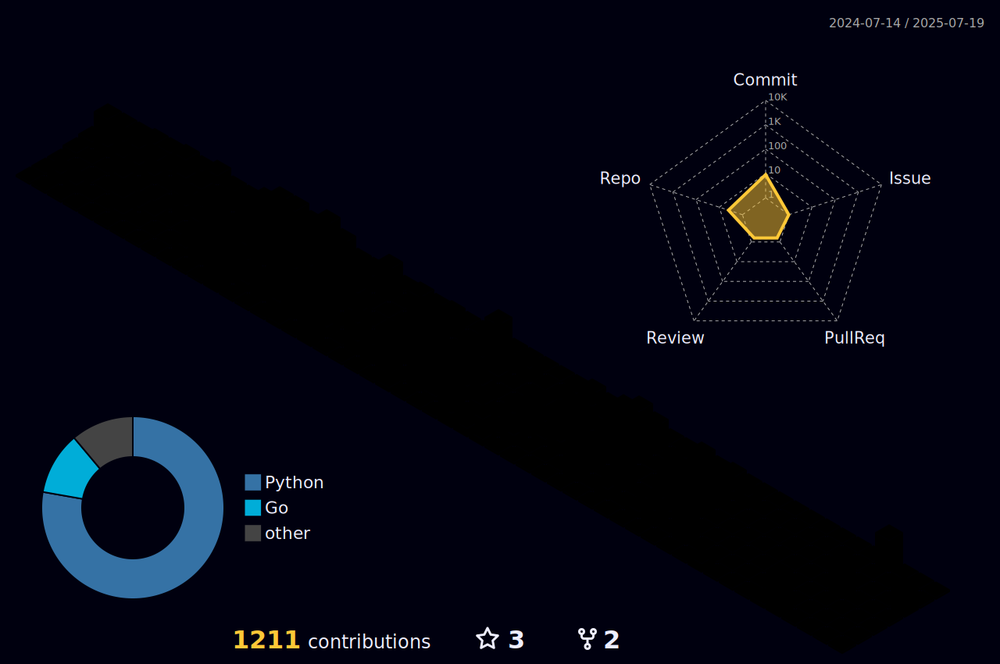

 

## 

### 💡 &nbsp;About Me 
 
*  Love Programming.
   
*  As a challenge enthusiastic, I am diving into the Web API world.
*  I'm on track for learning more about API and Infra knowledge.

### 🌱 Full Stack Projects(Click to learn more)
* 
  ######   Project Tech Stack: 
       

 

### 🛠️ Tech Stack

<!-- 

 -->

-  Programming Language
  
    &nbsp;&nbsp;

-  Web Framwork

       

 *  Frontend
 
    

-  Database

     

- Cloud

      
- Big Data Stack

      

- OS & Other Technologies

       &nbsp;&nbsp;&nbsp;
